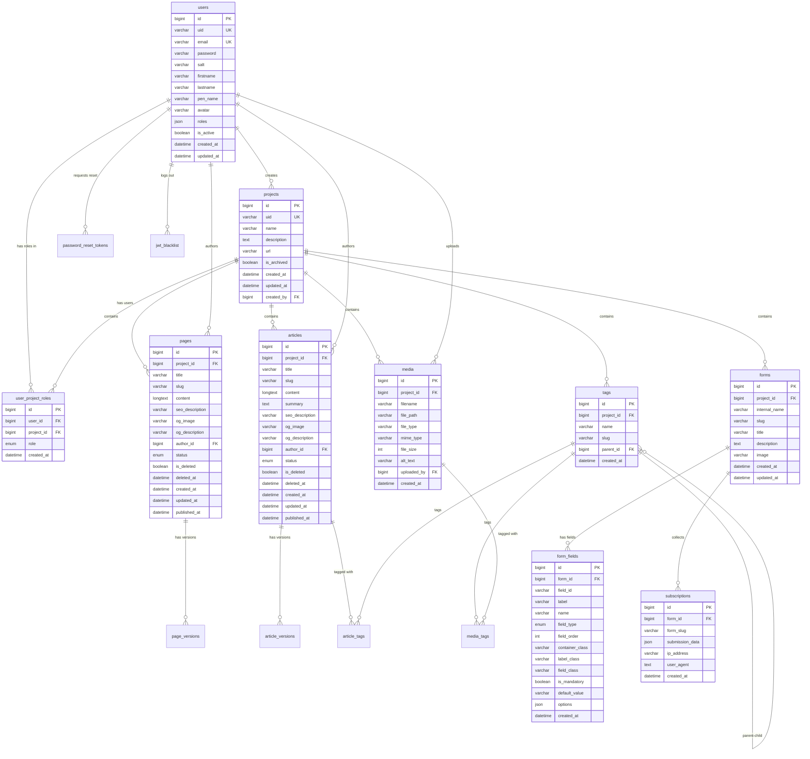

# Database Model

## Overview

The Titane CMS/CRM database is built on MariaDB 11.4 and follows a multi-tenant architecture where projects act as separate websites. All tables use UTF8MB4 character set for full Unicode support.

## Database Schema

### Core Tables

#### users
Stores all system users with different role capabilities.

| Column | Type | Constraints | Description |
|--------|------|-------------|-------------|
| id | BIGINT UNSIGNED | PRIMARY KEY, AUTO_INCREMENT | Unique identifier |
| uid | VARCHAR(36) | UNIQUE, NOT NULL | UUID for external references |
| email | VARCHAR(255) | UNIQUE, NOT NULL | User's email address |
| password | VARCHAR(255) | NOT NULL | Argon2 hashed password |
| salt | VARCHAR(8) | NOT NULL | Per-user alphanumeric salt |
| firstname | VARCHAR(100) | NOT NULL | User's first name |
| lastname | VARCHAR(100) | NOT NULL | User's last name |
| pen_name | VARCHAR(100) | NOT NULL | Display name for content authorship |
| avatar | VARCHAR(255) | NULL | Path to avatar image |
| roles | JSON | NOT NULL | Array of role assignments |
| is_active | BOOLEAN | DEFAULT TRUE | Account status |
| created_at | DATETIME | NOT NULL | Account creation timestamp |
| updated_at | DATETIME | NOT NULL | Last update timestamp |

#### projects
Core entity representing separate websites/applications.

| Column | Type | Constraints | Description |
|--------|------|-------------|-------------|
| id | BIGINT UNSIGNED | PRIMARY KEY, AUTO_INCREMENT | Unique identifier |
| uid | VARCHAR(36) | UNIQUE, NOT NULL | UUID for API access |
| name | VARCHAR(255) | NOT NULL | Project name |
| description | TEXT | NULL | Project description |
| url | VARCHAR(255) | NULL | Project website URL |
| is_archived | BOOLEAN | DEFAULT FALSE | Archive status (read-only) |
| created_at | DATETIME | NOT NULL | Creation timestamp |
| updated_at | DATETIME | NOT NULL | Last update timestamp |
| created_by | BIGINT UNSIGNED | FOREIGN KEY (users.id) | Creator user ID |

#### user_project_roles
Many-to-many relationship table for user-project access.

| Column | Type | Constraints | Description |
|--------|------|-------------|-------------|
| id | BIGINT UNSIGNED | PRIMARY KEY, AUTO_INCREMENT | Unique identifier |
| user_id | BIGINT UNSIGNED | FOREIGN KEY (users.id), NOT NULL | User reference |
| project_id | BIGINT UNSIGNED | FOREIGN KEY (projects.id), NOT NULL | Project reference |
| role | ENUM('super_admin', 'admin', 'co_admin') | NOT NULL | User's role in project |
| created_at | DATETIME | NOT NULL | Assignment timestamp |
| UNIQUE KEY | (user_id, project_id) | | One role per user per project |

### Content Tables

#### pages
Static content pages with SEO support.

| Column | Type | Constraints | Description |
|--------|------|-------------|-------------|
| id | BIGINT UNSIGNED | PRIMARY KEY, AUTO_INCREMENT | Unique identifier |
| project_id | BIGINT UNSIGNED | FOREIGN KEY (projects.id), NOT NULL | Parent project |
| title | VARCHAR(255) | NOT NULL | Page title |
| slug | VARCHAR(255) | NOT NULL | URL-friendly identifier |
| content | LONGTEXT | NULL | HTML content |
| seo_description | VARCHAR(160) | NULL | SEO meta description |
| og_image | VARCHAR(255) | NULL | Open Graph image URL |
| og_description | VARCHAR(255) | NULL | Open Graph description |
| author_id | BIGINT UNSIGNED | FOREIGN KEY (users.id), NOT NULL | Content author |
| status | ENUM('not_published', 'published', 'draft') | DEFAULT 'not_published' | Publication status |
| is_deleted | BOOLEAN | DEFAULT FALSE | Soft delete flag |
| deleted_at | DATETIME | NULL | Deletion timestamp |
| created_at | DATETIME | NOT NULL | Creation timestamp |
| updated_at | DATETIME | NOT NULL | Last update timestamp |
| published_at | DATETIME | NULL | Publication timestamp |
| UNIQUE KEY | (project_id, slug) | | Unique slug per project |

#### page_versions
Version history for pages (excludes drafts).

| Column | Type | Constraints | Description |
|--------|------|-------------|-------------|
| id | BIGINT UNSIGNED | PRIMARY KEY, AUTO_INCREMENT | Unique identifier |
| page_id | BIGINT UNSIGNED | FOREIGN KEY (pages.id), NOT NULL | Parent page |
| version_number | INT UNSIGNED | NOT NULL | Sequential version number |
| title | VARCHAR(255) | NOT NULL | Version title |
| content | LONGTEXT | NULL | Version content |
| seo_description | VARCHAR(160) | NULL | Version SEO description |
| og_image | VARCHAR(255) | NULL | Version OG image |
| og_description | VARCHAR(255) | NULL | Version OG description |
| author_id | BIGINT UNSIGNED | FOREIGN KEY (users.id), NOT NULL | Version author |
| created_at | DATETIME | NOT NULL | Version creation timestamp |
| UNIQUE KEY | (page_id, version_number) | | Sequential versioning |

#### articles
Dynamic content with mandatory tagging.

| Column | Type | Constraints | Description |
|--------|------|-------------|-------------|
| id | BIGINT UNSIGNED | PRIMARY KEY, AUTO_INCREMENT | Unique identifier |
| project_id | BIGINT UNSIGNED | FOREIGN KEY (projects.id), NOT NULL | Parent project |
| title | VARCHAR(255) | NOT NULL | Article title |
| slug | VARCHAR(255) | NOT NULL | URL-friendly identifier |
| content | LONGTEXT | NULL | HTML content |
| summary | TEXT | NULL | Auto-generated + editable summary |
| seo_description | VARCHAR(160) | NULL | SEO meta description |
| og_image | VARCHAR(255) | NULL | Open Graph image URL |
| og_description | VARCHAR(255) | NULL | Open Graph description |
| author_id | BIGINT UNSIGNED | FOREIGN KEY (users.id), NOT NULL | Content author |
| status | ENUM('not_published', 'published', 'draft') | DEFAULT 'not_published' | Publication status |
| is_deleted | BOOLEAN | DEFAULT FALSE | Soft delete flag |
| deleted_at | DATETIME | NULL | Deletion timestamp |
| created_at | DATETIME | NOT NULL | Creation timestamp |
| updated_at | DATETIME | NOT NULL | Last update timestamp |
| published_at | DATETIME | NULL | Publication timestamp |
| UNIQUE KEY | (project_id, slug) | | Unique slug per project |

#### article_versions
Version history for articles (excludes drafts).

| Column | Type | Constraints | Description |
|--------|------|-------------|-------------|
| id | BIGINT UNSIGNED | PRIMARY KEY, AUTO_INCREMENT | Unique identifier |
| article_id | BIGINT UNSIGNED | FOREIGN KEY (articles.id), NOT NULL | Parent article |
| version_number | INT UNSIGNED | NOT NULL | Sequential version number |
| title | VARCHAR(255) | NOT NULL | Version title |
| content | LONGTEXT | NULL | Version content |
| summary | TEXT | NULL | Version summary |
| seo_description | VARCHAR(160) | NULL | Version SEO description |
| og_image | VARCHAR(255) | NULL | Version OG image |
| og_description | VARCHAR(255) | NULL | Version OG description |
| author_id | BIGINT UNSIGNED | FOREIGN KEY (users.id), NOT NULL | Version author |
| created_at | DATETIME | NOT NULL | Version creation timestamp |
| UNIQUE KEY | (article_id, version_number) | | Sequential versioning |

### Taxonomy Tables

#### tags
Hierarchical categorization for articles and media.

| Column | Type | Constraints | Description |
|--------|------|-------------|-------------|
| id | BIGINT UNSIGNED | PRIMARY KEY, AUTO_INCREMENT | Unique identifier |
| project_id | BIGINT UNSIGNED | FOREIGN KEY (projects.id), NOT NULL | Parent project |
| name | VARCHAR(100) | NOT NULL | Tag name |
| slug | VARCHAR(100) | NOT NULL | URL-friendly identifier |
| parent_id | BIGINT UNSIGNED | FOREIGN KEY (tags.id), NULL | Parent tag (one level only) |
| created_at | DATETIME | NOT NULL | Creation timestamp |
| UNIQUE KEY | (project_id, slug) | | Unique slug per project |

#### article_tags
Many-to-many relationship for article tagging.

| Column | Type | Constraints | Description |
|--------|------|-------------|-------------|
| article_id | BIGINT UNSIGNED | FOREIGN KEY (articles.id), NOT NULL | Article reference |
| tag_id | BIGINT UNSIGNED | FOREIGN KEY (tags.id), NOT NULL | Tag reference |
| PRIMARY KEY | (article_id, tag_id) | | Composite primary key |

### Media Tables

#### media
Project-specific file storage.

| Column | Type | Constraints | Description |
|--------|------|-------------|-------------|
| id | BIGINT UNSIGNED | PRIMARY KEY, AUTO_INCREMENT | Unique identifier |
| project_id | BIGINT UNSIGNED | FOREIGN KEY (projects.id), NOT NULL | Parent project |
| filename | VARCHAR(255) | NOT NULL | Original filename |
| file_path | VARCHAR(500) | NOT NULL | Storage path |
| file_type | VARCHAR(10) | NOT NULL | File extension |
| mime_type | VARCHAR(100) | NOT NULL | MIME type |
| file_size | INT UNSIGNED | NOT NULL | Size in bytes (max 2MB) |
| alt_text | VARCHAR(255) | NULL | Alternative text for images |
| uploaded_by | BIGINT UNSIGNED | FOREIGN KEY (users.id), NOT NULL | Uploader user ID |
| created_at | DATETIME | NOT NULL | Upload timestamp |

#### media_tags
Many-to-many relationship for media tagging.

| Column | Type | Constraints | Description |
|--------|------|-------------|-------------|
| media_id | BIGINT UNSIGNED | FOREIGN KEY (media.id), NOT NULL | Media reference |
| tag_id | BIGINT UNSIGNED | FOREIGN KEY (tags.id), NOT NULL | Tag reference |
| PRIMARY KEY | (media_id, tag_id) | | Composite primary key |

### Form Tables

#### forms
Dynamic subscription forms.

| Column | Type | Constraints | Description |
|--------|------|-------------|-------------|
| id | BIGINT UNSIGNED | PRIMARY KEY, AUTO_INCREMENT | Unique identifier |
| project_id | BIGINT UNSIGNED | FOREIGN KEY (projects.id), NOT NULL | Parent project |
| internal_name | VARCHAR(255) | NOT NULL | Internal identifier |
| slug | VARCHAR(255) | NOT NULL | URL-friendly identifier |
| title | VARCHAR(255) | NULL | Display title |
| description | TEXT | NULL | Form description |
| image | VARCHAR(255) | NULL | Associated image |
| created_at | DATETIME | NOT NULL | Creation timestamp |
| updated_at | DATETIME | NOT NULL | Last update timestamp |
| UNIQUE KEY | (project_id, slug) | | Unique slug per project |

#### form_fields
Configurable fields for forms.

| Column | Type | Constraints | Description |
|--------|------|-------------|-------------|
| id | BIGINT UNSIGNED | PRIMARY KEY, AUTO_INCREMENT | Unique identifier |
| form_id | BIGINT UNSIGNED | FOREIGN KEY (forms.id), NOT NULL | Parent form |
| field_id | VARCHAR(50) | NOT NULL | HTML field ID |
| label | VARCHAR(255) | NOT NULL | Field label |
| name | VARCHAR(50) | NOT NULL | Field name (no spaces) |
| field_type | ENUM('text', 'email', 'phone', 'checkbox', 'radio') | NOT NULL | Input type |
| field_order | INT UNSIGNED | NOT NULL | Display order |
| container_class | VARCHAR(255) | NULL | CSS class for container |
| label_class | VARCHAR(255) | NULL | CSS class for label |
| field_class | VARCHAR(255) | NULL | CSS class for field |
| is_mandatory | BOOLEAN | DEFAULT FALSE | Required field flag |
| default_value | VARCHAR(255) | NULL | Default field value |
| options | JSON | NULL | Options for radio/checkbox |
| created_at | DATETIME | NOT NULL | Creation timestamp |

#### subscriptions
Submitted form data.

| Column | Type | Constraints | Description |
|--------|------|-------------|-------------|
| id | BIGINT UNSIGNED | PRIMARY KEY, AUTO_INCREMENT | Unique identifier |
| form_id | BIGINT UNSIGNED | FOREIGN KEY (forms.id), NOT NULL | Source form |
| form_slug | VARCHAR(255) | NOT NULL | Form slug (for filtering) |
| submission_data | JSON | NOT NULL | Submitted field values |
| ip_address | VARCHAR(45) | NULL | Submitter IP (IPv4/IPv6) |
| user_agent | TEXT | NULL | Browser user agent |
| created_at | DATETIME | NOT NULL | Submission timestamp |
| INDEX | (form_slug) | | Fast filtering by form |

### Security Tables

#### password_reset_tokens
Temporary tokens for password reset functionality.

| Column | Type | Constraints | Description |
|--------|------|-------------|-------------|
| id | BIGINT UNSIGNED | PRIMARY KEY, AUTO_INCREMENT | Unique identifier |
| token_uid | VARCHAR(36) | UNIQUE, NOT NULL | Reset token UUID |
| user_id | BIGINT UNSIGNED | FOREIGN KEY (users.id), NOT NULL | Target user |
| expires_at | DATETIME | NOT NULL | Token expiration (30 min) |
| created_at | DATETIME | NOT NULL | Token creation timestamp |
| used_at | DATETIME | NULL | Token usage timestamp |
| INDEX | (expires_at) | | Cleanup expired tokens |

#### jwt_blacklist
Invalidated JWT tokens (for logout functionality).

| Column | Type | Constraints | Description |
|--------|------|-------------|-------------|
| id | BIGINT UNSIGNED | PRIMARY KEY, AUTO_INCREMENT | Unique identifier |
| jti | VARCHAR(255) | UNIQUE, NOT NULL | JWT ID claim |
| user_id | BIGINT UNSIGNED | FOREIGN KEY (users.id), NOT NULL | Token owner |
| expires_at | DATETIME | NOT NULL | Original token expiration |
| created_at | DATETIME | NOT NULL | Blacklist timestamp |
| INDEX | (expires_at) | | Cleanup expired entries |

## Database Schema Diagram

## Key Design Decisions

### 1. Multi-tenancy via Projects
- Each project acts as an isolated container for content
- Users can have different roles across projects
- All content is scoped to a specific project

### 2. Soft Deletes
- Pages and articles use soft delete pattern (is_deleted flag)
- Allows for trash/recycle bin functionality
- Permanent deletion removes all versions

### 3. Version Control
- Only published content generates versions
- Drafts do not create version entries
- Allows rollback to any previous version

### 4. Flexible Tagging
- Tags are hierarchical (one level only)
- Articles require at least one tag
- Media can be tagged for organization

### 5. Security Features
- Per-user salt for password hashing
- JWT blacklist for explicit logout
- Temporary tokens for password reset
- Role-based access control at project level

### 6. JSON Fields
- User roles stored as JSON for flexibility
- Form submission data stored as JSON
- Radio/checkbox options stored as JSON

## Indexes and Performance

### Primary Indexes
- All tables use BIGINT UNSIGNED primary keys with AUTO_INCREMENT
- UUIDs (uid fields) are indexed for API access

### Composite Indexes
- (project_id, slug) for unique URL paths
- (user_id, project_id) for role assignments
- Many-to-many junction tables use composite primary keys

### Performance Indexes
- form_slug on subscriptions for fast filtering
- expires_at on security tables for cleanup jobs
- Foreign keys automatically create indexes

## Data Integrity

### Foreign Key Constraints
- ON DELETE CASCADE for:
  - user_project_roles when user or project deleted
  - page_versions when page deleted
  - article_versions when article deleted
  - article_tags when article or tag deleted
  - media_tags when media or tag deleted
  - form_fields when form deleted

- ON DELETE RESTRICT for:
  - Project created_by (prevent user deletion if owns projects)
  - Content author_id (preserve authorship history)

### Unique Constraints
- User email must be unique system-wide
- UIDs must be unique per table
- Slugs must be unique within project scope
- One role per user per project

## Migration Notes

1. Create tables in dependency order:
   - users → projects → user_project_roles
   - projects → tags, pages, articles, media, forms
   - pages → page_versions
   - articles → article_versions, article_tags
   - media → media_tags
   - forms → form_fields → subscriptions
   - users → password_reset_tokens, jwt_blacklist

2. Charset and collation:
   - Use `utf8mb4` charset
   - Use `utf8mb4_unicode_ci` collation

3. Engine:
   - Use InnoDB for all tables (transaction support)

4. Timestamp defaults:
   - created_at: CURRENT_TIMESTAMP
   - updated_at: CURRENT_TIMESTAMP ON UPDATE CURRENT_TIMESTAMP